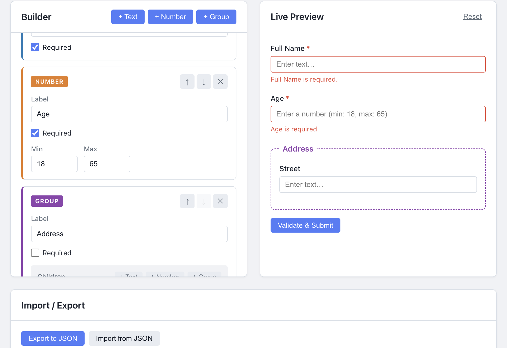
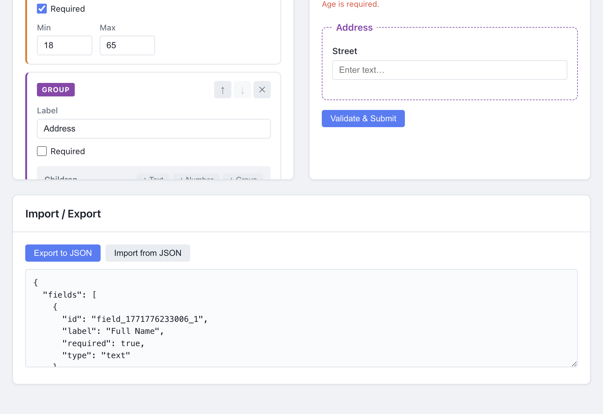

# Configurable Form Builder

A recursive form engine built from scratch with **React 19** and **TypeScript** — no UI kits, no form libraries, no state managers.

**[Live Demo](https://form-builder-ui-web.vercel.app)**

---

## Screenshots

### Builder + Live Preview


### Validation Errors



### JSON Import / Export



---

## Tech Stack

React 19 | TypeScript 5.9 (strict) | Vite 7 | Pure CSS | ESLint 9

Only runtime dependency is React. Everything else — state, validation, styling — is built from scratch.

---

## Features

- **Recursive nesting** — Text, Number, and Group fields. Groups nest infinitely.
- **Live preview** — Mirrors the builder schema in real time with working inputs.
- **Validation** — Required, min/max, type checking. Errors show inline per-field.
- **JSON import/export** — Three-layer validation: syntax, structural type-guard, duplicate ID detection.
- **Reordering** — Move fields up/down at any nesting level.
- **Error boundary** — Graceful crash recovery.

---

## Getting Started

```bash
npm install
npm run dev        # localhost:5173
npm run build      # tsc + vite build
npm run lint
```

---

## How It Works

The schema is a tree — groups contain children that can themselves be groups. All state lives in a single `useReducer`. The key piece is `updateFieldsAtPath(fields, path, updater)`, a recursive helper that walks a chain of field IDs, spreads new objects at each level for immutability, and lets each action type (add, update, delete, move) provide its own updater. One function, five actions, zero duplicated logic.

Siblings off the mutation path keep the same reference, so `React.memo` skips them. Combined with `useMemo`'d field paths and `useCallback`'d handlers, editing a deeply nested field only re-renders the nodes along that path.

---

## Project Structure

```bash
src/
├── types/          # Discriminated unions (FormField = Text | Number | Group)
├── constants/      # Action keys, field types, all UI strings
├── state/          # Context + useReducer with recursive tree traversal
├── hooks/          # useFormContext
├── utils/          # Field factory, schema validator, form validator
├── components/
│   ├── Builder/    # Recursive field editor with per-field hooks
│   ├── Preview/    # Recursive preview renderer with errorMap
│   └── ImportExport/
├── styles/         # Modular CSS (tokens, layout, builder, preview)
└── App.tsx         # ErrorBoundary → FormProvider → Panels
```

---

## Edge Cases Handled

- **Duplicate IDs on import** — Rejected by the schema validator to prevent key collisions.
- **Min > Max in builder** — Inline warning shown immediately.
- **Empty groups** — Valid, rendered as empty fieldsets.
- **Deep trees** — Performance scales with mutation depth, not tree size.

---

## Testing

39 unit tests covering all pure business logic — run with `npm test`.

| Suite | Coverage |
| ----- | -------- |

| `formReducer` | ADD / UPDATE / DELETE / MOVE / IMPORT + immutability |
| `validateFields` | required, min, max, NaN, nested groups |
| `isValidSchema` | structure, types, duplicate ID detection |
| `formatting` | message helpers, placeholder composition |

## Future Enhancements

- Drag-and-drop reordering
- Undo/Redo history
- Regex validation for text fields
- Server-side persistence

---

## Author

Ravisankar Chinnam
